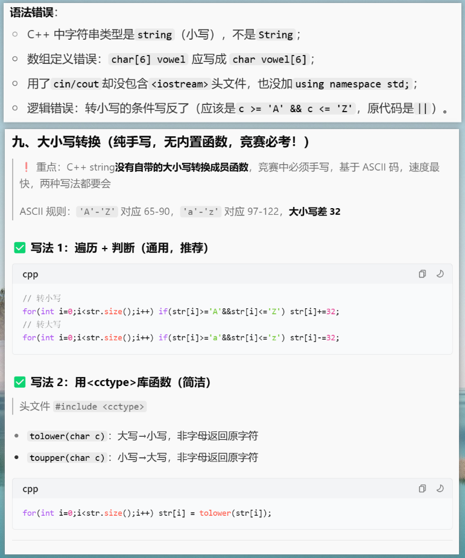
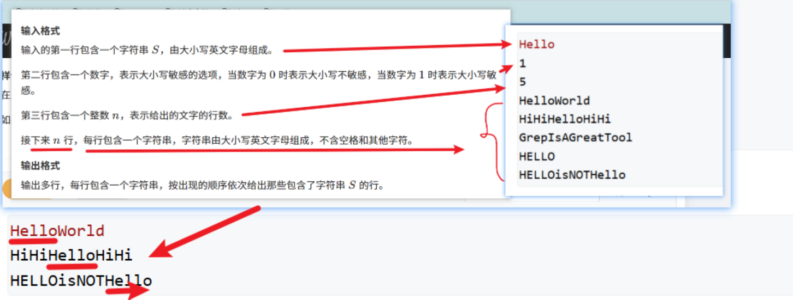
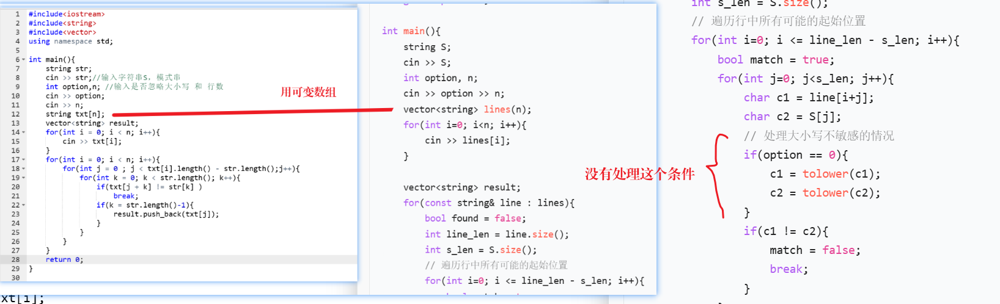
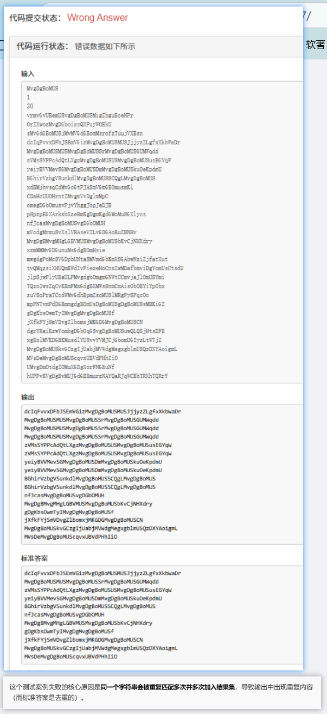

1. https://www.acwing.com/problem/content/4218/ 字符串处理
 
掌握知识
- 字符串大小写转换
- 字符串拼接
- C++ 输入输出语句

```C++
#include<iostream>  //包含输入输出函数
#include<string>
using namespace std;
int main(){
    
    //用一个String变量接受输入的字符串
    string str;      //用于接收输入
    string result;   // 用于存放结果
    cin>>str;
    int strLen = str.size();
    
    //使用uptolowcase  直接将所有的字符变成小写
    for(int i =0 ; i< strLen;i++){
        
        //1.遍历每个字符，第一步先转小写
        if(str[i] >= 65 && str[i] <= 90){
            str[i]+=32;
        }
        
        
        //2.判断是不是元音，是元音直接跳过此次循环
        if(str[i] == 'a' || str[i] == 'o' || str[i] == 'y'|| str[i] == 'e' || str[i] == 'u'|| str[i] == 'i'){
            continue;
        }
        
        
        
        //3.不是元音，加入result，加之前，先放一个'.'
        
        result += '.';
        result += str[i];   //使用字符串拼接
        
    }
    
    cout << result << endl;
    
    return 0;
}
```


2. https://www.acwing.com/problem/content/3207/

掌握知识点
- 字符串模式匹配(BF暴力求解)
- vector容器的构造与访问插入








```c++
#include<iostream>
#include<string>
#include<vector>
#include<cctype>
using namespace std;

int main(){
    string str;
    cin >> str;//输入字符串S，模式串
    int option,n; //输入是否忽略大小写 和 行数
    cin >> option;
    cin >> n;
    vector<string> line(n);
    vector<string> result;
    for(int i = 0; i < n; i++){
        cin >> line[i];
    }
    
    
    for(int i = 0; i < n; i++){
        bool match = false;  // 标记当前行是否已经匹配成功
        int line_len = line[i].length();
        int str_len= str.length();
        for(int j = 0 ; j <=line_len - str_len && !match       ;j++){  // 一旦匹配成功，就跳出该行的循环
            for(int k = 0; k < str_len; k++){
                
                char c1 = line[i][j+k];
                char c2 = str[k];
                
                if(option == 0){
                    c1 = tolower(c1);
                    c2 = tolower(c2);
                }
                
                if(c1 != c2)
                    break;
                if(k ==str.length()-1){
                    result.push_back(line[i]);
                    match = true;   // 标记为已匹配，后续不再处理这一行
                }
            }
        }
    }
    
    for(const string& s : result){
        cout << s << endl;
    }
    
    return 0;
}


```
