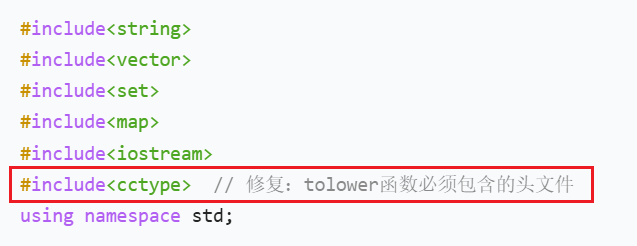
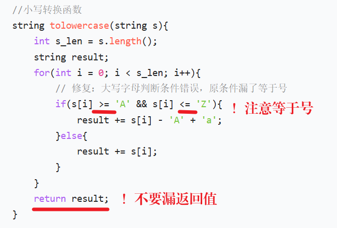
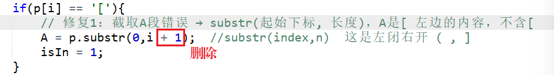
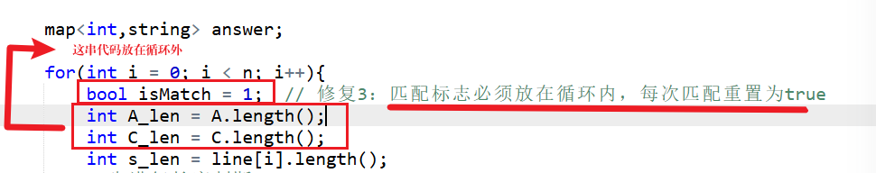
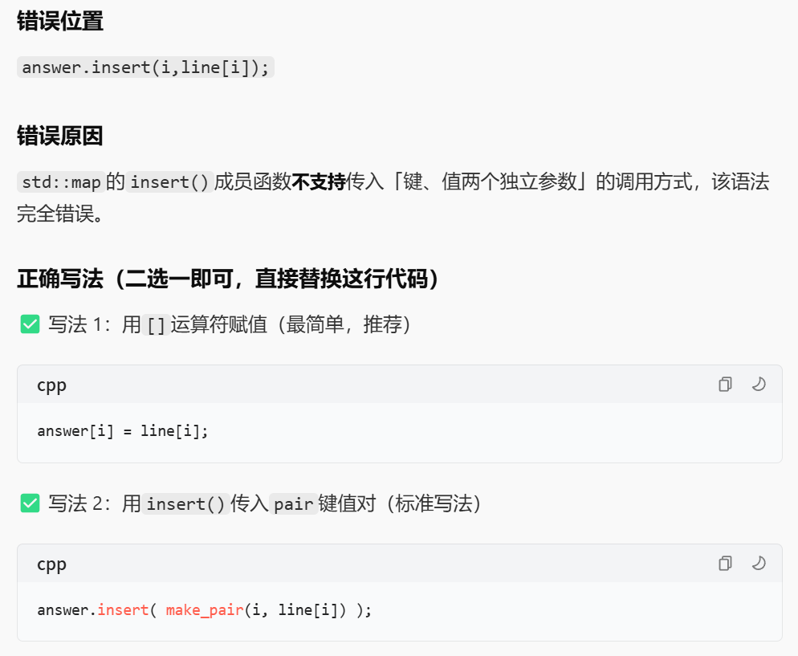

# 3528.字符串匹配 https://www.acwing.com/problem/content/description/3531/

易错点：












```c++
#include<iostream>
#include<cstring>


using namespace std;

const int N = 1010;

int n;
string s[N], p;

bool match(string t) {
    int i, j;
    for (i = 0, j = 0; i < t.size() && j < p.size(); i ++ ) {
        if (p[j] == '[') {
            bool find = false;
            while(p[j] != ']') {
                if (p[ ++ j ] == t[i]) {
                    find = true;
                    break;
                }
            }
            if (!find) return false;
            while(j < p.size() && p[j - 1] != ']') j ++ ;
            continue;
        }
        if (p[j ++ ] != t[i]) return false;
    }
    return i == t.size() && j == p.size();
}

int main() {
    cin >> n;
    for (int i = 1; i <= n; i ++ ) cin >> s[i];
    cin >> p;
    for (int i = 0; i < p.size(); i ++ )
        if (p[i] >= 'A' && p[i] <= 'Z') p[i] += 'a' - 'A';

    for (int i = 1; i <= n; i ++ ) {
        string t;
        for (int j = 0; j < s[i].size(); j ++ )
            if (s[i][j] >= 'A' && s[i][j] <= 'Z') t += s[i][j] + 'a' - 'A';
            else t += s[i][j];

        if (match(t)) cout << i << ' ' << s[i] << endl;
    }

    return 0;
}

// 作者：yangracy
// 链接：https://www.acwing.com/solution/content/65345/
// 来源：AcWing
// 著作权归作者所有。商业转载请联系作者获得授权，非商业转载请注明出处。
```