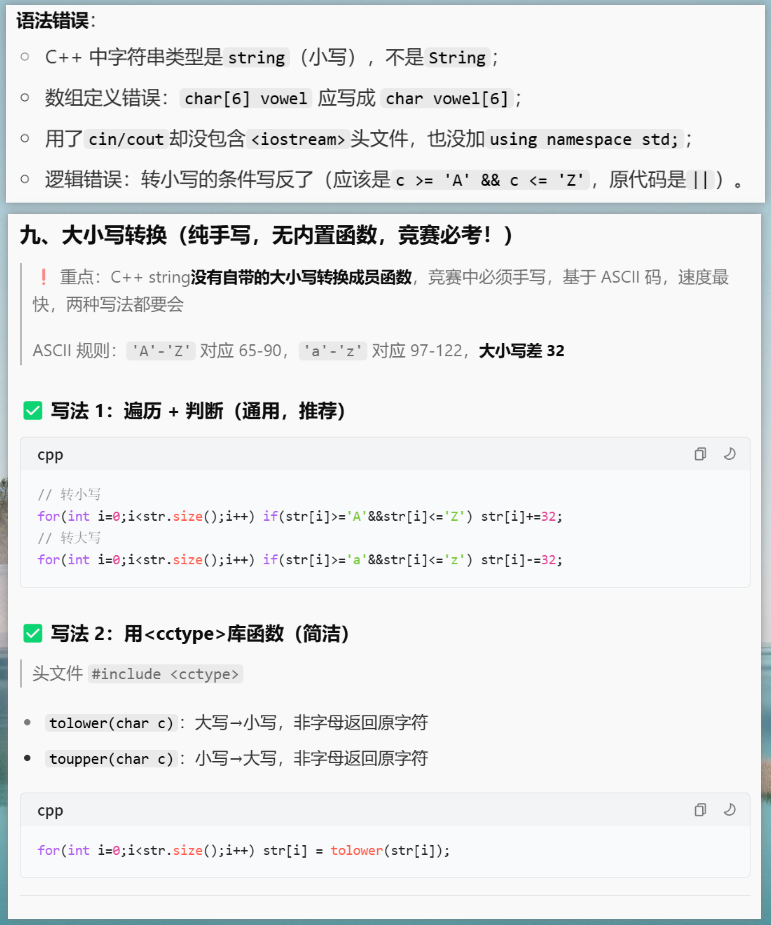
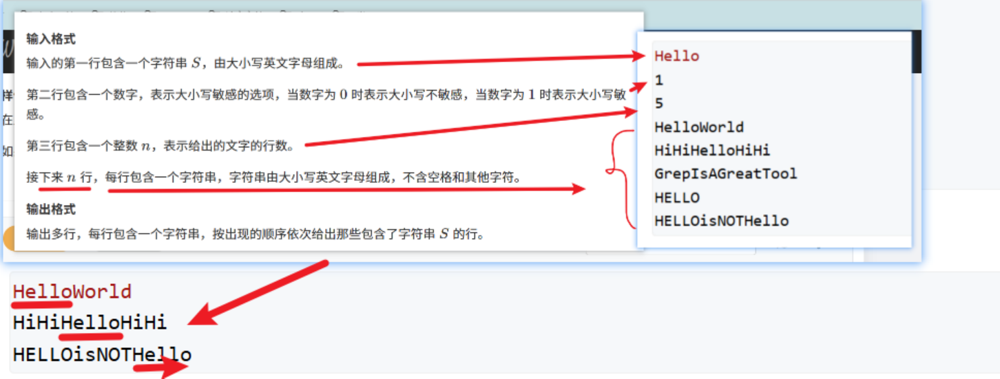
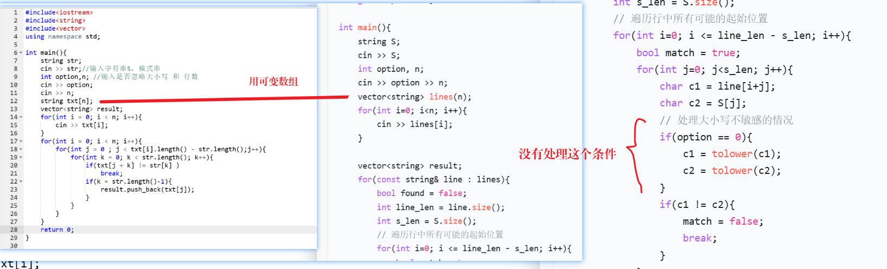
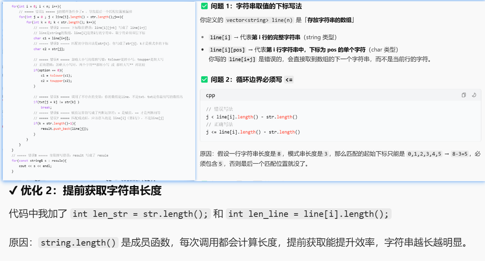
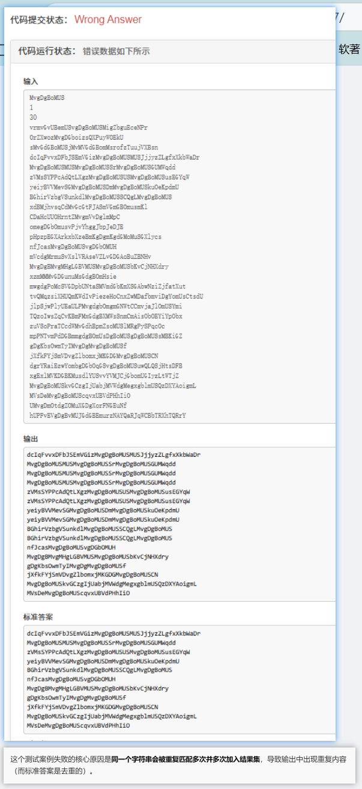

# 字符串练习（AcWing 4218 / 3207）

## 1) 过滤元音并加点（AcWing 4218）
- 链接： https://www.acwing.com/problem/content/4218/

### ✅ AC 代码（C++）
```c++
#include <iostream>
#include <string>
using namespace std;

int main() {
    string str;
    cin >> str;
    string result;

    for (char c : str) {
        if (c >= 'A' && c <= 'Z') c += 'a' - 'A';
        if (c == 'a' || c == 'o' || c == 'y' || c == 'e' || c == 'u' || c == 'i')
            continue;
        result += '.';
        result += c;
    }

    cout << result << endl;
    return 0;
}
```

---

## 2) 模式匹配（AcWing 3207）
- 链接： https://www.acwing.com/problem/content/3207/

### ✅ AC 代码（C++）
```c++
#include <iostream>
#include <string>
#include <vector>
#include <cctype>
using namespace std;

int main() {
    string pat;
    cin >> pat;
    int option, n;
    cin >> option >> n;

    vector<string> line(n);
    for (int i = 0; i < n; i++) cin >> line[i];

    vector<string> result;
    for (int i = 0; i < n; i++) {
        bool match = false;
        int line_len = line[i].length();
        int pat_len = pat.length();
        for (int j = 0; j <= line_len - pat_len && !match; j++) {
            for (int k = 0; k < pat_len; k++) {
                char c1 = line[i][j + k];
                char c2 = pat[k];
                if (option == 0) {
                    c1 = tolower(c1);
                    c2 = tolower(c2);
                }
                if (c1 != c2) break;
                if (k == pat_len - 1) {
                    result.push_back(line[i]);
                    match = true;
                }
            }
        }
    }

    for (const string& s : result) cout << s << endl;
    return 0;
}
```

---

## 🖼️ 截图（路径已修正）
- 图 1（过滤元音）：
  - 

- 图 2（模式匹配）：
  - 
  - 
  - 
  - 

