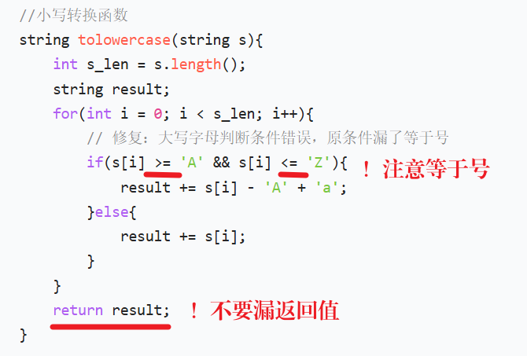
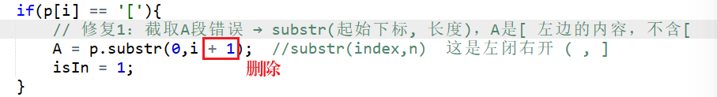
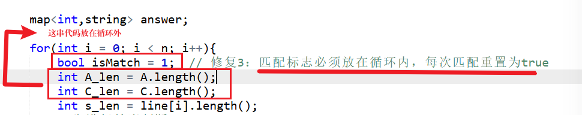
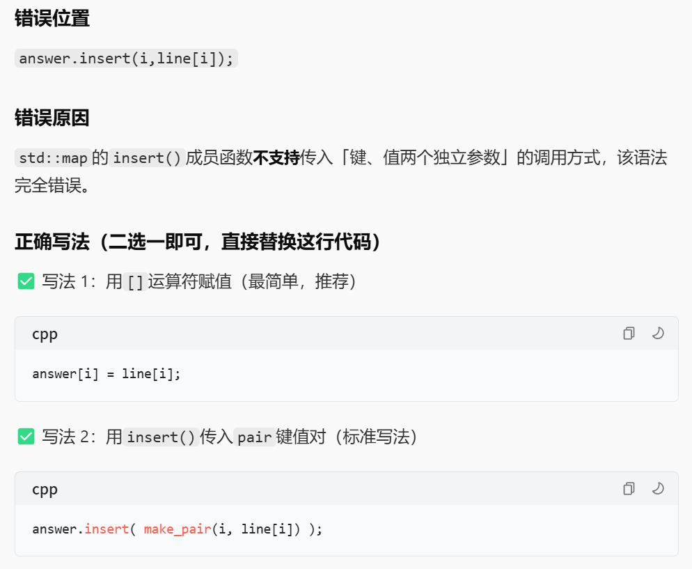
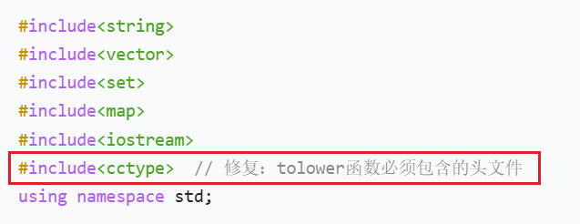

# 字符串匹配（AcWing 3528）
- 链接： https://www.acwing.com/problem/content/description/3531/

## ✅ 代码（C++）
```c++
#include <iostream>
#include <cstring>
#include <string>
using namespace std;

const int N = 1010;
int n;
string s[N], p;

bool match(const string& t) {
    int i = 0, j = 0;
    while (i < (int)t.size() && j < (int)p.size()) {
        if (p[j] == '[') {
            bool found = false;
            while (p[j] != ']') {
                if (p[++j] == t[i]) {
                    found = true;
                    break;
                }
            }
            if (!found) return false;
            while (j < (int)p.size() && p[j - 1] != ']') j++;
            continue;
        }
        if (p[j++] != t[i]) return false;
        i++;
    }
    return i == (int)t.size() && j == (int)p.size();
}

int main() {
    cin >> n;
    for (int i = 1; i <= n; i++) cin >> s[i];
    cin >> p;
    for (char &c : p) {
        if (c >= 'A' && c <= 'Z') c += 'a' - 'A';
    }

    for (int i = 1; i <= n; i++) {
        string t;
        for (char c : s[i]) {
            if (c >= 'A' && c <= 'Z') c += 'a' - 'A';
            t += c;
        }
        if (match(t)) cout << i << ' ' << s[i] << endl;
    }
    return 0;
}
```

## ⚠️ 易错点
- 要把输入字符串和模式都统一为小写再匹配。
- 模式中的字符集 `[...]` 需要特别处理。

---

## 🖼️ 相关截图（路径已修正）





