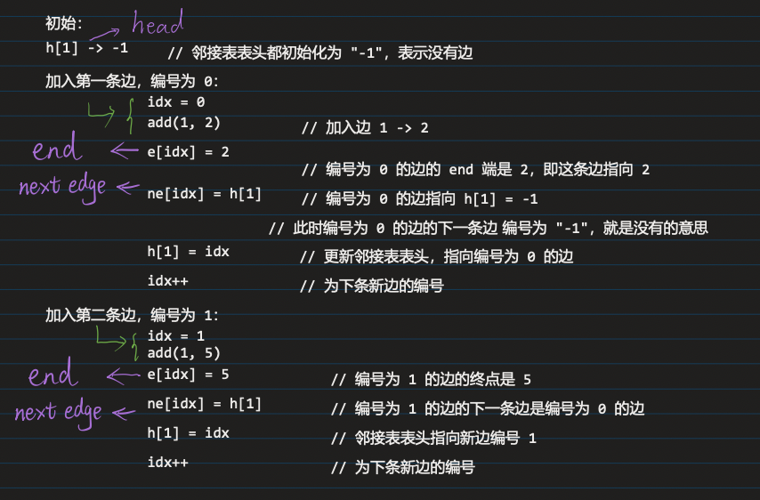

## DFS 深度优先搜索Depth-first search

[843. n-皇后问题](https://www.acwing.com/problem/content/845/)

[对角线与反对角线的取值BiLiBiLi讲解视频](https://www.bilibili.com/video/BV1wJ411U7Gy)

```c++
#include <iostream>

const int N = 20;  //对角线的个数是长款的两倍

int n;
char g[N][N];
bool col[N],dg[N],udg[N];

using namespace std;

void dfs(int u){
    if(u == n){
        for(int i = 0; i < n; i++) puts(g[i]);
        puts("");
        return;
    }
    for(int i = 0; i < n; i++){
        if( !col[i] && !dg[u + i] && !udg[u - i + n]){  //行 - 列 -> 在一条对角线上的值都相等; 行 + 列 -> 在反对角线上的值都相等
            g[u][i] = 'Q';
            col[i] = dg[i + u] = udg[u - i + n] = true;
            dfs(u + 1);
            //恢复现场
            col[i] = dg[i + u] = udg[u - i + n] = false;
            g[u][i] = '.';
        }
    }
}

int main(){
    //初始化
    cin >> n;
    for(int i = 0; i < n; i++){
        for(int j = 0; j < n ; j++){
            g[i][j] = '.';
        }
    }
    
    dfs(0);
    
    return 0 ;
    
}
```

## BFS 广度优先搜索Breadth-first search

[844. 走迷宫](https://www.acwing.com/problem/content/846/)
```c++
#include <iostream>
#include <cstring>      //使用 memset() 函数


using namespace std;

int n,m;
typedef pair<int, int> PII;

const int N = 110;
int d[N][N];    //记录每个点到(0,0)的距离
int g[N][N];    //地图
PII q[N * N];   //模拟队列

int bfs(){
    int hh = 0, tt = 0;
    q[0] = {0,0};
    memset(d,-1,sizeof d);      //没走过的地方都先初始化距离为-1
    d[0][0] = 0;                //初始化
    int dx[4] = {1, 0, -1, 0}, dy[4] = {0, 1, 0, -1};
    while(hh <= tt){
        auto t = q[hh ++ ]; 
        
        for(int i = 0; i < 4; i++){
            int x = t.first + dx[i], y = t.second + dy[i];  //四个方向都尝试走一下
            if(x >= 0 && x < n && y >= 0 && y < m && g[x][y] == 0 && d[x][y] == -1){
                d[x][y] = d[t.first][t.second] + 1;
                q[++ tt] = {x,y};                           //加入队列
            }
        }
    }
    return d[n-1][m-1];
}

int main(){
    cin >> n >> m;
    
    for(int i = 0; i < n; i++)
        for(int j = 0; j < m; j++)
            cin >> g[i][j];
    
    cout << bfs() << endl;
    return 0;
}
```


[845. 八数码](https://www.acwing.com/problem/content/847/)

这段代码是 八数码 BFS 的标准思路，但你这里有几处错误，会导致 编译失败 或 逻辑错误。

主要问题有这几个：

1. q.pop() 后面少了分号

这里：
```c++
q.pop()
```
应该改成：
```c++
q.pop();
```
2. 交换位置时下标写错了

你现在写的是：
```c++
swap(t[x], t[a * 3 + b]);
```
这里 x 是二维坐标里的行号，不是字符串的一维下标。
真正表示 'x' 在字符串里的位置的是前面算出来的 k。

所以应该改成：
```c++
swap(t[k], t[a * 3 + b]);
```
恢复现场时也一样：
```c++
swap(t[k], t[a * 3 + b]);
```

3. 最终代码
```c++
#include <iostream>
#include <queue>
#include <unordered_map>

using namespace std;

int bfs(string start){
    //定义重点字符串
    string end = "12345678x";
    
    queue<string> q;                //存放状态
    unordered_map<string,int> d;      //记录到这个状态字符串的距离
    q.push(start);                  //初始化
    d[start] = 0;
    
    int dx[4] = {0, 1, 0, -1}, dy[4] = {1, 0, -1, 0};
    
    while(q.size()){
        
        auto t = q.front();
        q.pop();
        
        int distance = d[t];
        
        if(t == end) return distance; 
        
        //状态转移
        int k = t.find('x');        //返回字符'x'在字符串中的一维坐标位置
        int x = k /3, y = k % 3;    //转化成在二维 3 x 3 表格中的位置 [0, 0] - [2, 2]
        
        for(int i = 0; i < 4; i++){
            int a = x + dx[i], b = y + dy[i];
            if(a >=0 && a < 3 && b >= 0 && b < 3){      //'x'移动位置后没有越界
                //交换位置并记录距离
                swap(t[k], t[a * 3 + b]);
                if(!d.count(t)){        //如果没有到达过这个状态
                    d[t] = distance + 1 ;
                    q.push(t);
                }
                //为了下次循环恢复现场
                swap(t[k], t[a * 3 + b]);
            }
        }
        
    }
    
    return -1;
    
}

int main(){
    string start;
    //输入初始八字码
    for(int i = 0; i < 9; i ++){
        char c;
        cin >> c;
        start += c;
    }
    cout << bfs(start) ;
    return 0;
}
```


[846. 树的重心](https://www.acwing.com/problem/content/848/)

插入边函数分析：
```c++
void add(int a, int b){
    e[idx] = b, ne[idx] = h[a], h[a] = idx++;   
}
```

`idx`  是新边的编号，第一条边的编号是0

`e[idx]`  是新边指向的终点，`add(a, b)`说明，这是一条`a -> b`的边。`e[idx] = b`, 将这条边的终点指向 `b`节点。

`h[a]`    是节点`a`指向的边的编号，一开始都初始化为`-1`，表示都没有边加入

`ne[idx] = h[a]`    此时，`h[a]`还没有更新，指向的是上一条边的编号，`ne[idx]`就是将新边指向旧边

`h[a] = idx` 现在将头节点指向新边

`idx++`  编号增一，为下一次循环准备



如何遍历a点的所有出边
```c++
for (int i = h[a]; i != -1; i = ne[i]) {
    int b = e[i];
    cout << a << " -> " << b << endl;
}
```
这是头插法，后插入的先输出


你这段代码是在做 树的重心，整体思路是对的，但这里有一个关键错误，会导致遍历出问题。

错误在这一行

你写的是：
```c++
for(int i = h[u]; h[i] != -1; i = ne[i]){
```
这里条件写错了。

应该写成：
```c++
for(int i = h[u]; i != -1; i = ne[i]){
```

`i` 是什么?

`i` 表示当前正在遍历的边编号。

AC代码：

```c++
#include <iostream>
#include <cstring>
#include <algorithm>

using namespace std;
//使用数组模拟图
const int N = 100010, M = 2 * N;   //最多 N 条加边操作，而无向边加两次 

int e[M],ne[M],h[N],idx;
bool st[N];             //记录当前点是否被访问
int ans = N;
int n;

void add(int a, int b){
    e[idx] = b, ne[idx] = h[a], h[a] = idx ++;
}

//以u为根的子树中 点的数量
int dfs(int u){
    st[u] = true;//标记一下，已经被搜过了
    
    int sum = 1, res = 0;
    for(int i = h[u]; i != -1; i = ne[i]){
        int j = e[i];
        if(!st[j]){
            int s = dfs(j);
            res = max(s, res);
            sum += s;
        }
    }
    res = max(res, n - sum);
    
    ans = min(ans, res);
    
    return sum;
}

int main(){
 
    cin >> n;
    memset(h, -1, sizeof h);
    for(int i = 0; i < n - 1; i ++){
        int a,b;
        cin >> a >> b;
        add(a, b), add(b, a);
    }
    
    //节点数 >= 1
    dfs(1);
    
    cout << ans << endl;
    
    return 0;
    
}
```